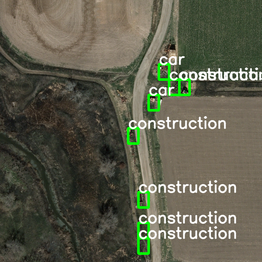

# Vehicle-classification-and-Localization-in-aerial-image
#[Winner of Smart India Hackathon 2017 Defence Production](https://innovate.mygov.in/sih2017/)

## Problem statement provided by ministry of Defence
Airborne platforms e.g. Aircrafts , Helicopters , UAVs etc are
used for surveillance and reconnaissance activities. It is
required that the onboard imaging system should capture the
moving objects on ground and perform data processing in
real time to recognize the objects. Images shall be captured
from onboard camera installed on airborne platforms
(Aircrafts , Helicopters , UAVs etc ). The identified ground
moving object needs to be matched with pre-stored object
signature. Accordingly the object type needs to be recognized
in terms of the objects(e.g. Car , Bus etc), object type (e.g.
Car type: Swift Desire etc ).

## Pipeline
1. The aerial image is taken through the input pipeline, the resolution can be dynamic.
2. A sliding window  (256 * 256 ) creates frames samples of the input images.
3. The Frames are feed to a Shallow CNN which generates the probability of finding objects in the frame. The probabilities are passed through an adaptive filter (uses standard deviation) to select the frame to be passed forward. ( The highlighted green block are the block selected.)
If a vehicle is on the boundary of a block, every block will be selected touching the  vehicle.  
4. Another moving window ( 30*40 , dynamic according to the zoom) produces multiple frames given the output of the previous CNN.
5 .The Frames are feed to the next CNN which generates the probability of vehicles in the frame. The probabilities are passed through an adaptive filter (uses standard deviation) to select the frame to be passed forward as shown.
6. The Vehicles detected are further passed to the next CNN which classify the vehicle type ( Car , Truck , Construction Vehicle , Camping Car etc)
7. The signature matching part is Multiplexed with the signature part ( ie If the signature is Car, It will only be matched to vehicles classified as car, the selectiveness saves times when finding vehicles on high density road).
8. The Signature matching part is done with another CNN with only one output class. The CNN is trained with signature and augmented samples of signature. The output is a probability generated which is again passed through an adaptive filter
9. The Benefit of using CNN is that it can give accuracy even if the intensity, size and orientation is varied.

## Development setup

Language  : Python
#Dependencies:
1. Keras
2. Tensorflow
3. Numpy
4. OpenCV

## Dataset used
[Vehicle Detection in Aerial Imagery (VEDAI)](https://downloads.greyc.fr/vedai/)  

## Meta
Sanket Gujar  – srgujar@wpi.edu

